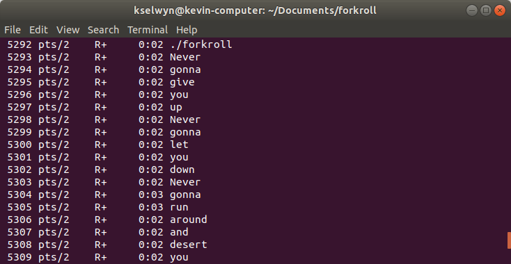

# forkroll

Give your processes catchier lyrics


## Building

```bash
make
```

## Usage

```bash
./forkroll
```

Run `ps -a` in another window to see what happened:



## Explanation

Did you know you could [overwrite the name of your process](http://www.uofr.net/~greg/processname.html) so it displays differently in `ps`?

Now you do.